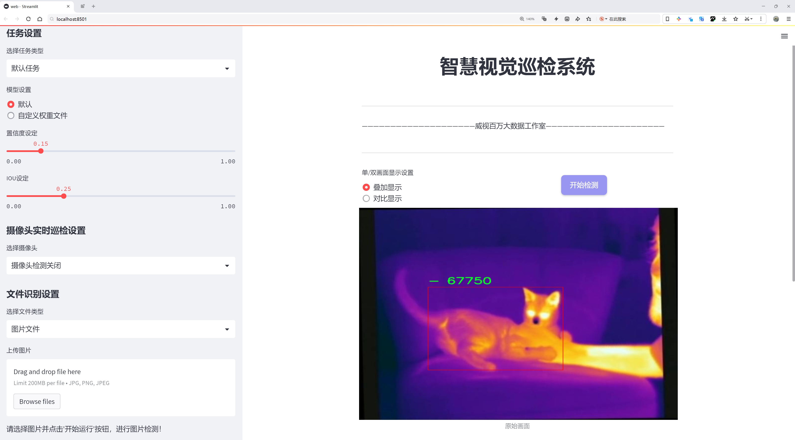
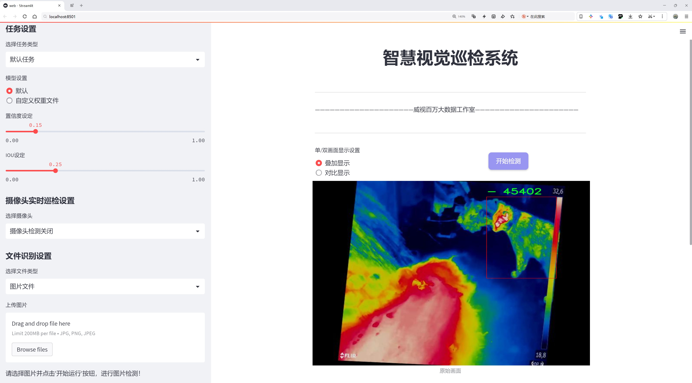
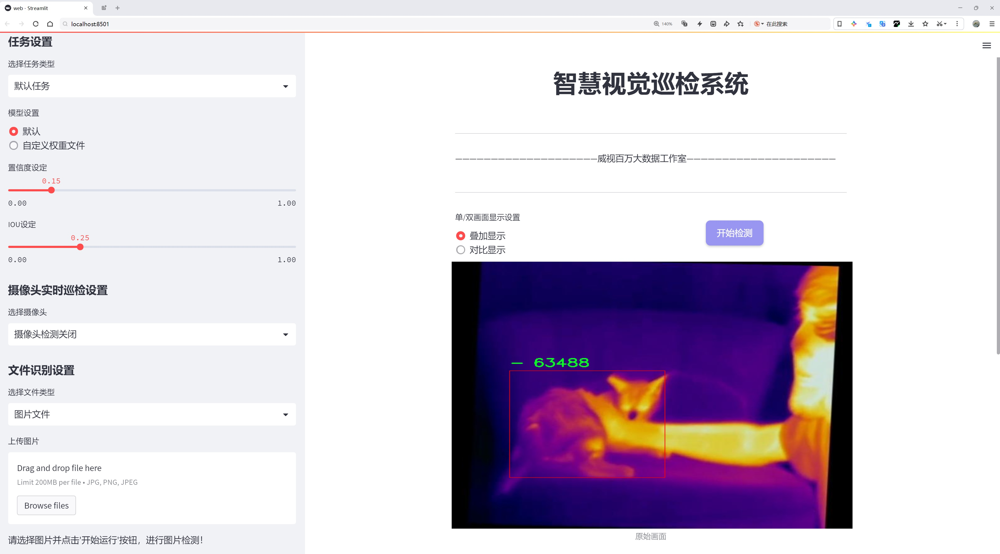
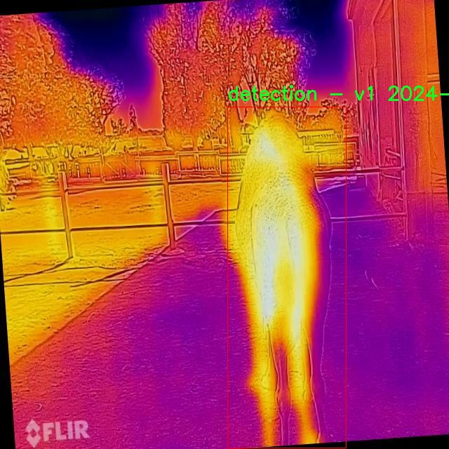
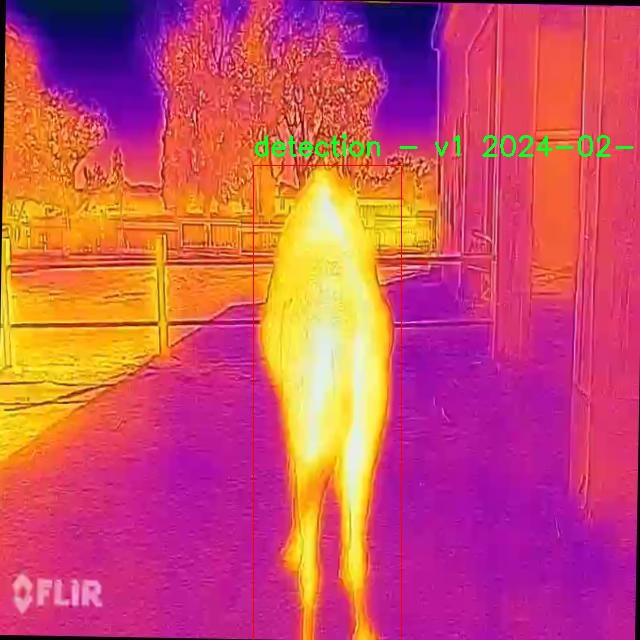
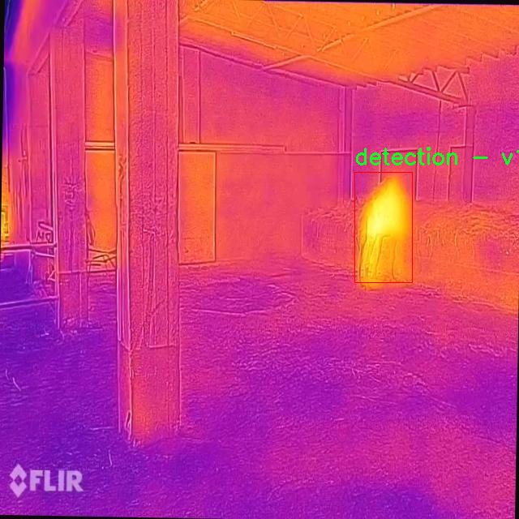
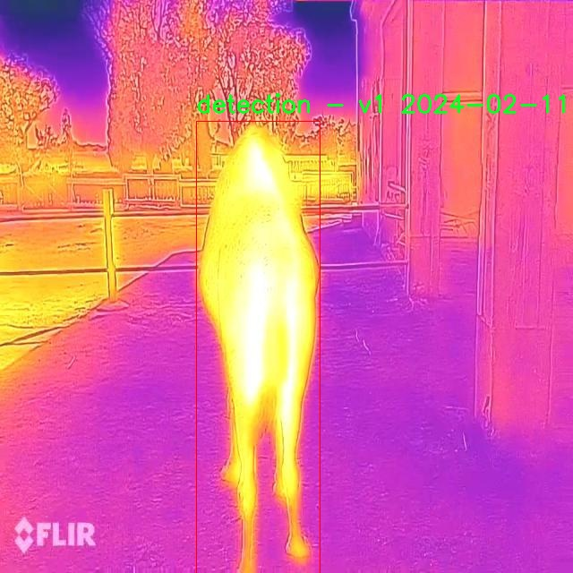
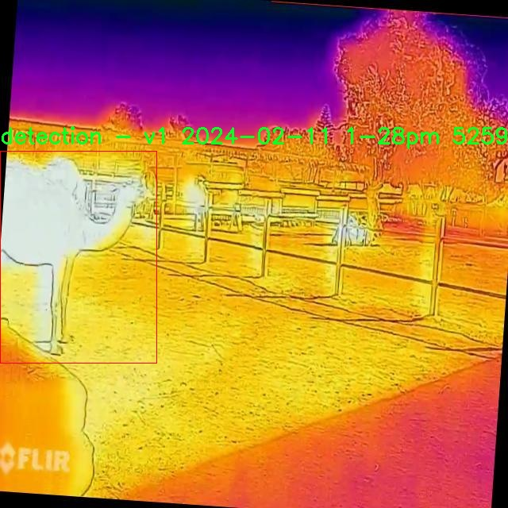

# 夜间红外图宠物检测检测系统源码分享
 # [一条龙教学YOLOV8标注好的数据集一键训练_70+全套改进创新点发刊_Web前端展示]

### 1.研究背景与意义

项目参考[AAAI Association for the Advancement of Artificial Intelligence](https://gitee.com/qunmasj/projects)

项目来源[AACV Association for the Advancement of Computer Vision](https://kdocs.cn/l/cszuIiCKVNis)

研究背景与意义

随着科技的不断进步，计算机视觉技术在各个领域的应用日益广泛，尤其是在物体检测和识别方面。近年来，深度学习技术的迅猛发展使得目标检测的精度和效率有了显著提升。其中，YOLO（You Only Look Once）系列模型因其高效的实时检测能力而受到广泛关注。YOLOv8作为该系列的最新版本，进一步优化了模型结构和算法，提升了在复杂环境下的检测性能。然而，现有的YOLOv8模型在夜间或低光照条件下的表现仍然存在一定的局限性，尤其是在宠物检测领域。

在宠物监控和管理中，夜间红外图像的应用越来越普遍。宠物主人希望能够在夜间监控宠物的活动，以确保其安全和健康。现有的宠物检测系统多集中于白天或良好光照条件下的图像处理，而对于夜间红外图像的有效检测尚缺乏系统性的研究。因此，基于改进YOLOv8的夜间红外图宠物检测系统的研究显得尤为重要。

本研究的意义在于通过改进YOLOv8模型，使其能够在夜间红外图像中有效识别和检测宠物，尤其是猫这一特定类别。研究中使用的数据集包含2200张图像，专注于猫这一类宠物的检测。这一数据集的构建为模型的训练和测试提供了坚实的基础，确保了研究的科学性和有效性。通过对夜间红外图像的深入分析和处理，研究将探讨如何利用改进的YOLOv8模型提升在低光照条件下的检测精度，进而实现实时监控和智能识别。

此外，本研究还将探讨在夜间红外图像中，如何通过数据增强、特征提取和模型优化等手段，提升模型对猫的检测能力。这不仅能够丰富现有的目标检测技术，还能为宠物监控系统的实际应用提供理论支持和技术保障。通过实现高效的夜间宠物检测，能够帮助宠物主人及时了解宠物的活动状态，预防潜在的安全隐患。

总之，基于改进YOLOv8的夜间红外图宠物检测系统的研究，不仅具有重要的学术价值，也具有广泛的社会应用前景。随着宠物数量的增加和人们对宠物安全关注度的提升，开发一套高效、准确的夜间宠物检测系统将为宠物管理和监控提供新的解决方案。这一研究不仅能够推动计算机视觉和深度学习技术在宠物监控领域的应用，还将为相关技术的进一步发展提供重要的参考和借鉴。

### 2.图片演示







##### 注意：由于此博客编辑较早，上面“2.图片演示”和“3.视频演示”展示的系统图片或者视频可能为老版本，新版本在老版本的基础上升级如下：（实际效果以升级的新版本为准）

  （1）适配了YOLOV8的“目标检测”模型和“实例分割”模型，通过加载相应的权重（.pt）文件即可自适应加载模型。

  （2）支持“图片识别”、“视频识别”、“摄像头实时识别”三种识别模式。

  （3）支持“图片识别”、“视频识别”、“摄像头实时识别”三种识别结果保存导出，解决手动导出（容易卡顿出现爆内存）存在的问题，识别完自动保存结果并导出到tempDir中。

  （4）支持Web前端系统中的标题、背景图等自定义修改，后面提供修改教程。

  另外本项目提供训练的数据集和训练教程,暂不提供权重文件（best.pt）,需要您按照教程进行训练后实现图片演示和Web前端界面演示的效果。

### 3.视频演示

[3.1 视频演示](https://www.bilibili.com/video/BV1LcsSeXESn/)

### 4.数据集信息展示

##### 4.1 本项目数据集详细数据（类别数＆类别名）

nc: 5
names: ['-', '- collaborate with your team on computer vision projects', 'Roboflow is an end-to-end computer vision platform that helps you', 'This dataset was exported via roboflow.com on February 11- 2024 at 9-25 AM GMT', 'detection - v1 2024-02-11 1-28pm']


##### 4.2 本项目数据集信息介绍

数据集信息展示

在本研究中，我们使用了名为“pet”的数据集，旨在训练和改进YOLOv8模型，以实现高效的夜间红外图像宠物检测系统。该数据集专门设计用于支持计算机视觉领域的相关项目，尤其是在宠物检测这一特定应用场景中。数据集的构建考虑到了多种环境因素，尤其是夜间低光照条件下的图像采集，确保模型能够在实际应用中具备良好的性能。

“pet”数据集包含5个类别，虽然具体的类别名称在数据集中并未详细列出，但我们可以推测这些类别可能涵盖了不同种类的宠物，如猫、狗等，或是与宠物相关的其他对象。这种多样性使得数据集在训练过程中能够提供丰富的样本，从而提高模型的泛化能力。通过对不同类别的宠物进行标注，研究者能够有效地评估模型在不同场景下的表现，确保其在复杂环境中的准确性和可靠性。

该数据集的构建过程注重了数据的多样性和代表性。图像采集涵盖了不同的时间段和环境条件，尤其是夜间场景的多样性，这对于训练一个能够在低光照条件下准确识别宠物的模型至关重要。此外，数据集的设计还考虑到了数据标注的准确性和一致性，以确保训练出的模型能够在实际应用中达到预期的效果。

数据集的导出时间为2024年2月11日，标志着其在计算机视觉领域应用的最新进展。此时间节点的选择不仅反映了数据集的时效性，也为后续的研究提供了重要的参考依据。研究者可以基于此数据集进行进一步的实验和验证，推动夜间红外图像处理技术的发展。

在数据集的使用过程中，研究者将采用YOLOv8这一先进的目标检测模型。YOLOv8以其高效的检测速度和优越的准确性而闻名，尤其适合于实时检测任务。通过对“pet”数据集的训练，研究者希望能够进一步提升YOLOv8在夜间红外图像处理中的表现，使其能够在实际应用中实现更高的检测率和更低的误报率。

总之，“pet”数据集为本研究提供了一个坚实的基础，使得研究者能够在夜间红外图像宠物检测领域进行深入探索。通过对该数据集的充分利用，结合YOLOv8模型的优势，我们期待能够在宠物检测技术上取得显著的进展，为相关应用提供更为精准和高效的解决方案。











### 5.全套项目环境部署视频教程（零基础手把手教学）

[5.1 环境部署教程链接（零基础手把手教学）](https://www.ixigua.com/7404473917358506534?logTag=c807d0cbc21c0ef59de5)


[5.2 安装Python虚拟环境创建和依赖库安装视频教程链接（零基础手把手教学）](https://www.ixigua.com/7404474678003106304?logTag=1f1041108cd1f708b01a)

### 6.手把手YOLOV8训练视频教程（零基础小白有手就能学会）

[6.1 手把手YOLOV8训练视频教程（零基础小白有手就能学会）](https://www.ixigua.com/7404477157818401292?logTag=d31a2dfd1983c9668658)

### 7.70+种全套YOLOV8创新点代码加载调参视频教程（一键加载写好的改进模型的配置文件）

[7.1 70+种全套YOLOV8创新点代码加载调参视频教程（一键加载写好的改进模型的配置文件）](https://www.ixigua.com/7404478314661806627?logTag=29066f8288e3f4eea3a4)

### 8.70+种全套YOLOV8创新点原理讲解（非科班也可以轻松写刊发刊，V10版本正在科研待更新）

由于篇幅限制，每个创新点的具体原理讲解就不一一展开，具体见下列网址中的创新点对应子项目的技术原理博客网址【Blog】：


[8.1 70+种全套YOLOV8创新点原理讲解链接](https://gitee.com/qunmasj/good)

### 9.系统功能展示（检测对象为举例，实际内容以本项目数据集为准）

图9.1.系统支持检测结果表格显示

  图9.2.系统支持置信度和IOU阈值手动调节

  图9.3.系统支持自定义加载权重文件best.pt(需要你通过步骤5中训练获得)

  图9.4.系统支持摄像头实时识别

  图9.5.系统支持图片识别

  图9.6.系统支持视频识别

  图9.7.系统支持识别结果文件自动保存

  图9.8.系统支持Excel导出检测结果数据


### 10.原始YOLOV8算法原理

原始YOLOv8算法原理

YOLOv8是由Ultralytics公司于2023年推出的目标检测算法系列中的最新版本，标志着YOLO系列在目标检测领域的又一次重大进步。与前几代YOLO算法相比，YOLOv8在检测精度、速度和模型轻量化方面都取得了显著的提升。YOLOv8的设计理念围绕着高效性和实时性展开，特别适合在嵌入式设备和资源受限的环境中应用。

YOLOv8的网络结构主要由四个部分组成：输入端、主干网络（backbone）、颈部网络（neck）和检测头（head）。输入端的设计采用了马赛克数据增强技术，这种方法通过将多张图像拼接在一起，生成多样化的训练样本，从而增强模型的泛化能力。此外，YOLOv8还引入了自适应锚框计算和自适应灰度填充，以提高模型对不同场景的适应性。

在主干网络部分，YOLOv8采用了CSP（Cross Stage Partial）结构，这种结构通过将特征提取过程分为两个部分，分别进行卷积和连接，极大地提高了特征提取的效率。具体而言，YOLOv8n版本中引入了C2f模块，这一模块通过更多的分支跨层连接，形成了更为丰富的梯度流，从而增强了模型的特征表示能力。C2f模块的设计灵感来源于YOLOv7的ELAN结构，经过优化后，能够更好地捕捉到不同尺度和形状的目标特征。

颈部网络采用了PAN-FPN（Path Aggregation Network - Feature Pyramid Network）结构，这一结构的引入使得YOLOv8在特征融合方面表现得更加出色。PAN-FPN通过多尺度特征的聚合，有效地增强了模型对不同尺度目标的检测能力，尤其是在复杂场景下，能够更好地处理小目标和大目标的检测任务。

在检测头部分，YOLOv8的创新之处在于采用了解耦头结构。这一结构将分类和回归任务分离开来，使得每个任务可以更加专注于自身的目标，从而提高了模型在复杂场景下的定位精度和分类准确性。与传统的耦合头相比，解耦头结构在处理多任务时能够减少相互干扰，提升整体性能。此外，YOLOv8采用了Anchor-Free的目标检测方法，这种方法的核心在于不再依赖于预定义的锚框，而是通过回归方式直接预测目标的位置和大小。这一创新使得模型能够更快地聚焦于目标位置，显著提高了检测速度和准确性。

YOLOv8的损失函数设计也体现了其在精度上的追求。模型采用了Task-Aligned Assigner策略进行正负样本的分配，确保了训练过程中样本的合理性和有效性。在损失计算方面，分类分支使用了二元交叉熵损失（BCELoss），而回归分支则结合了分布焦点损失（DFLoss）和完全交并比损失（CIOULoss），这两种损失函数的结合有效提升了模型对边界框预测的精准性。

值得一提的是，YOLOv8在模型的轻量化方面也做了大量的工作。通过对不同尺度模型调整通道数，YOLOv8实现了进一步的模型精简。这一特性使得YOLOv8能够在保证检测精度的前提下，显著降低模型的计算量和存储需求，适应更广泛的应用场景。

总的来说，YOLOv8在设计上充分考虑了实时性、精度和模型轻量化的需求，通过一系列创新的网络结构和算法设计，推动了目标检测技术的发展。其在特征提取、特征融合和检测头设计上的改进，使得YOLOv8在各种复杂场景下都能表现出色，成为目标检测领域的重要工具。随着YOLOv8的推广和应用，预计将在自动驾驶、安防监控、智能家居等多个领域发挥重要作用，进一步推动智能视觉技术的发展。


### 11.项目核心源码讲解（再也不用担心看不懂代码逻辑）

#### 11.1 code\ultralytics\hub\session.py

以下是经过精简和注释的核心代码部分，主要关注于 `HUBTrainingSession` 类的关键功能和方法。

```python
import threading
import time
from http import HTTPStatus
from pathlib import Path
import requests
from ultralytics.hub.utils import HUB_WEB_ROOT, PREFIX, TQDM
from ultralytics.utils import LOGGER, SETTINGS, checks, is_colab
from ultralytics.utils.errors import HUBModelError

class HUBTrainingSession:
    """
    HUBTrainingSession 类用于管理 Ultralytics HUB YOLO 模型的训练会话。
    主要功能包括模型初始化、心跳监测和检查点上传。
    """

    def __init__(self, identifier):
        """
        初始化 HUBTrainingSession，解析模型标识符并加载模型。

        Args:
            identifier (str): 模型标识符，可以是 URL 字符串或特定格式的模型键。
        """
        from hub_sdk import HUBClient

        # 设置速率限制
        self.rate_limits = {
            "metrics": 3.0,
            "ckpt": 900.0,
            "heartbeat": 300.0,
        }
        self.metrics_queue = {}  # 存储每个 epoch 的指标
        self.timers = {}  # 存储定时器

        # 解析输入标识符
        api_key, model_id, self.filename = self._parse_identifier(identifier)

        # 获取凭证
        active_key = api_key or SETTINGS.get("api_key")
        credentials = {"api_key": active_key} if active_key else None

        # 初始化 HUB 客户端
        self.client = HUBClient(credentials)

        # 加载模型
        if model_id:
            self.load_model(model_id)
        else:
            self.model = self.client.model()  # 加载空模型

    def load_model(self, model_id):
        """从 Ultralytics HUB 加载现有模型。"""
        self.model = self.client.model(model_id)
        if not self.model.data:
            raise ValueError("❌ 指定的 HUB 模型不存在")

        self.model_url = f"{HUB_WEB_ROOT}/models/{self.model.id}"
        self._set_train_args()  # 设置训练参数

        # 启动心跳监测
        self.model.start_heartbeat(self.rate_limits["heartbeat"])
        LOGGER.info(f"{PREFIX}查看模型: {self.model_url} 🚀")

    def _parse_identifier(self, identifier):
        """
        解析给定的标识符，提取 API 密钥、模型 ID 和文件名。

        Args:
            identifier (str): 要解析的标识符字符串。

        Returns:
            (tuple): 包含 API 密钥、模型 ID 和文件名的元组。
        """
        api_key, model_id, filename = None, None, None

        # 检查标识符是否为 HUB URL
        if identifier.startswith(f"{HUB_WEB_ROOT}/models/"):
            model_id = identifier.split(f"{HUB_WEB_ROOT}/models/")[-1]
        else:
            parts = identifier.split("_")
            if len(parts) == 2 and len(parts[0]) == 42 and len(parts[1]) == 20:
                api_key, model_id = parts
            elif len(parts) == 1 and len(parts[0]) == 20:
                model_id = parts[0]
            elif identifier.endswith(".pt") or identifier.endswith(".yaml"):
                filename = identifier
            else:
                raise HUBModelError("无法解析模型标识符，请检查格式。")

        return api_key, model_id, filename

    def upload_model(self, epoch: int, weights: str, is_best: bool = False) -> None:
        """
        上传模型检查点到 Ultralytics HUB。

        Args:
            epoch (int): 当前训练的 epoch。
            weights (str): 模型权重文件的路径。
            is_best (bool): 当前模型是否为最佳模型。
        """
        if Path(weights).is_file():
            self.request_queue(
                self.model.upload_model,
                epoch=epoch,
                weights=weights,
                is_best=is_best,
                retry=10,
                timeout=3600,
                thread=True,
            )
        else:
            LOGGER.warning(f"{PREFIX}警告 ⚠️ 模型上传问题，缺少模型 {weights}。")

    def request_queue(self, request_func, retry=3, timeout=30, thread=True, *args, **kwargs):
        """
        封装请求函数，支持重试和超时机制。

        Args:
            request_func: 要调用的请求函数。
            retry (int): 重试次数。
            timeout (int): 超时时间。
            thread (bool): 是否在新线程中运行请求。
        """
        def retry_request():
            """尝试调用请求函数，支持重试和超时。"""
            t0 = time.time()
            for i in range(retry + 1):
                if (time.time() - t0) > timeout:
                    LOGGER.warning(f"{PREFIX}请求超时。")
                    break

                response = request_func(*args, **kwargs)
                if HTTPStatus.OK <= response.status_code < HTTPStatus.MULTIPLE_CHOICES:
                    return response  # 成功，无需重试

                time.sleep(2**i)  # 指数退避重试

            return response

        if thread:
            threading.Thread(target=retry_request, daemon=True).start()
        else:
            return retry_request()

    def _show_upload_progress(self, content_length: int, response: requests.Response) -> None:
        """
        显示文件上传进度条。

        Args:
            content_length (int): 要上传内容的总大小（字节）。
            response (requests.Response): 文件上传请求的响应对象。
        """
        with TQDM(total=content_length, unit="B", unit_scale=True, unit_divisor=1024) as pbar:
            for data in response.iter_content(chunk_size=1024):
                pbar.update(len(data))  # 更新进度条
```

### 代码说明：
1. **HUBTrainingSession 类**：负责管理与 Ultralytics HUB 的交互，包括模型的加载、上传和心跳监测。
2. **初始化方法 (`__init__`)**：解析输入标识符，设置速率限制，初始化 HUB 客户端。
3. **加载模型 (`load_model`)**：从 HUB 加载模型并设置训练参数。
4. **解析标识符 (`_parse_identifier`)**：解析不同格式的模型标识符，提取必要信息。
5. **上传模型 (`upload_model`)**：将训练好的模型权重上传到 HUB。
6. **请求队列 (`request_queue`)**：封装请求逻辑，支持重试和超时。
7. **显示上传进度 (`_show_upload_progress`)**：在上传过程中显示进度条。 

这些核心部分确保了与 Ultralytics HUB 的有效交互，并支持模型的训练和上传过程。

这个文件是Ultralytics YOLO项目中的一个重要组件，主要负责与Ultralytics HUB进行交互，管理模型的训练会话。它定义了一个名为`HUBTrainingSession`的类，负责模型的初始化、心跳监测和检查点上传等功能。

在类的构造函数`__init__`中，首先定义了一些速率限制和用于存储模型指标的队列。接着，它解析传入的模型标识符，获取API密钥和模型ID，并初始化与HUB的客户端连接。如果提供了有效的模型ID，则加载相应的模型；如果没有，则创建一个空模型。

`load_model`方法用于从Ultralytics HUB加载现有模型。它会检查模型是否存在，并设置训练参数。如果模型存在，它还会启动心跳机制，以便HUB能够监控代理的状态。

`create_model`方法则用于初始化一个新的训练会话，接收模型参数并构建一个有效的模型请求。它会创建一个新的模型并启动心跳监测。

`_parse_identifier`方法负责解析输入的标识符，支持多种格式，包括HUB URL、API密钥和模型ID的组合、单一模型ID以及本地文件名。它会返回API密钥、模型ID和文件名的元组。

`_set_train_args`方法初始化训练参数并在HUB上创建模型条目。它会检查模型是否已经训练过，并根据模型的状态设置相应的训练参数。

`request_queue`方法用于处理HTTP请求，支持重试机制、超时设置和多线程执行。它会在请求失败时根据状态码决定是否重试，并在达到最大重试次数后返回响应。

`_should_retry`方法根据HTTP状态码判断请求是否应该重试，而`_get_failure_message`方法则生成重试消息，帮助用户了解请求失败的原因。

`upload_metrics`和`upload_model`方法分别用于将模型的指标和检查点上传到Ultralytics HUB。`upload_model`方法还支持上传时显示进度条，以便用户了解上传的状态。

最后，`_show_upload_progress`方法实现了一个进度条，用于在文件上传时显示进度，提升用户体验。

整体来看，这个文件的设计旨在简化与Ultralytics HUB的交互，使得用户能够方便地管理YOLO模型的训练过程，同时提供了必要的错误处理和反馈机制。

#### 11.2 ui.py

```python
import sys
import subprocess

def run_script(script_path):
    """
    使用当前 Python 环境运行指定的脚本。

    Args:
        script_path (str): 要运行的脚本路径

    Returns:
        None
    """
    # 获取当前 Python 解释器的路径
    python_path = sys.executable

    # 构建运行命令，使用 streamlit 运行指定的脚本
    command = f'"{python_path}" -m streamlit run "{script_path}"'

    # 执行命令并等待其完成
    result = subprocess.run(command, shell=True)
    
    # 检查命令执行结果，如果返回码不为0，表示出错
    if result.returncode != 0:
        print("脚本运行出错。")


# 实例化并运行应用
if __name__ == "__main__":
    # 指定要运行的脚本路径
    script_path = "web.py"  # 假设脚本在当前目录下

    # 调用函数运行脚本
    run_script(script_path)
```

### 代码注释说明：
1. **导入模块**：
   - `sys`：用于获取当前 Python 解释器的路径。
   - `subprocess`：用于执行外部命令。

2. **定义 `run_script` 函数**：
   - 该函数接收一个参数 `script_path`，表示要运行的 Python 脚本的路径。
   - 使用 `sys.executable` 获取当前 Python 解释器的路径，以确保脚本在当前环境中运行。
   - 构建一个命令字符串，使用 `streamlit` 模块运行指定的脚本。
   - 使用 `subprocess.run` 执行命令，并等待其完成。
   - 检查命令的返回码，如果不为0，表示脚本运行出错，打印错误信息。

3. **主程序块**：
   - 当脚本作为主程序运行时，指定要运行的脚本路径（这里假设为 `web.py`）。
   - 调用 `run_script` 函数来执行指定的脚本。

这个程序文件名为 `ui.py`，其主要功能是通过当前的 Python 环境来运行一个指定的脚本，具体是一个名为 `web.py` 的文件。程序首先导入了必要的模块，包括 `sys`、`os` 和 `subprocess`，以及一个自定义的路径处理函数 `abs_path`。

在 `run_script` 函数中，首先获取当前 Python 解释器的路径，存储在 `python_path` 变量中。接着，构建一个命令字符串，该命令用于调用 `streamlit` 来运行指定的脚本。命令的格式为 `"{python_path}" -m streamlit run "{script_path}"`，其中 `script_path` 是传入的脚本路径。

然后，使用 `subprocess.run` 方法执行构建好的命令。这个方法会在一个新的 shell 中运行命令，并等待其完成。如果命令执行的返回码不为 0，表示脚本运行出错，程序会打印出相应的错误信息。

在文件的最后部分，使用 `if __name__ == "__main__":` 语句来确保当该文件作为主程序运行时，以下代码才会被执行。此处指定了要运行的脚本路径 `web.py`，并调用 `run_script` 函数来执行该脚本。

总体来说，这个程序的目的是为了方便地在当前 Python 环境中运行一个 Streamlit 应用，提供了一种简单的方式来启动 Web 应用。

#### 11.3 70+种YOLOv8算法改进源码大全和调试加载训练教程（非必要）\ultralytics\nn\extra_modules\head.py

以下是经过简化并添加详细中文注释的核心代码部分：

```python
import torch
import torch.nn as nn
from ultralytics.utils.tal import dist2bbox, make_anchors

class Detect_DyHead(nn.Module):
    """YOLOv8 检测头，使用动态头（DyHead）进行目标检测。"""
    
    def __init__(self, nc=80, hidc=256, block_num=2, ch=()):
        super().__init__()
        self.nc = nc  # 类别数量
        self.nl = len(ch)  # 检测层数量
        self.reg_max = 16  # DFL通道数
        self.no = nc + self.reg_max * 4  # 每个锚点的输出数量
        self.stride = torch.zeros(self.nl)  # 构建时计算的步幅
        self.conv = nn.ModuleList(nn.Sequential(Conv(x, hidc, 1)) for x in ch)  # 卷积层
        self.dyhead = nn.Sequential(*[DyHeadBlock(hidc) for _ in range(block_num)])  # 动态头块
        self.cv2 = nn.ModuleList(
            nn.Sequential(Conv(hidc, hidc // 4, 3), Conv(hidc // 4, hidc // 4, 3), nn.Conv2d(hidc // 4, 4 * self.reg_max, 1)) for _ in ch)
        self.cv3 = nn.ModuleList(nn.Sequential(Conv(hidc, nc, 3), Conv(nc, nc, 3), nn.Conv2d(nc, self.nc, 1)) for _ in ch)
        self.dfl = DFL(self.reg_max) if self.reg_max > 1 else nn.Identity()  # DFL层

    def forward(self, x):
        """连接并返回预测的边界框和类别概率。"""
        for i in range(self.nl):
            x[i] = self.conv[i](x[i])  # 应用卷积层
        x = self.dyhead(x)  # 应用动态头
        shape = x[0].shape  # 获取输出形状
        for i in range(self.nl):
            x[i] = torch.cat((self.cv2[i](x[i]), self.cv3[i](x[i])), 1)  # 合并输出
        if self.training:
            return x  # 训练模式下返回原始输出
        else:
            # 动态锚点生成
            self.anchors, self.strides = (x.transpose(0, 1) for x in make_anchors(x, self.stride, 0.5))
            x_cat = torch.cat([xi.view(shape[0], self.no, -1) for xi in x], 2)  # 合并输出
            box, cls = x_cat.split((self.reg_max * 4, self.nc), 1)  # 分割边界框和类别
            dbox = dist2bbox(self.dfl(box), self.anchors.unsqueeze(0), xywh=True, dim=1) * self.strides  # 计算边界框
            y = torch.cat((dbox, cls.sigmoid()), 1)  # 合并边界框和类别概率
            return y  # 返回最终输出

    def bias_init(self):
        """初始化检测头的偏置，警告：需要步幅可用。"""
        for a, b, s in zip(self.cv2, self.cv3, self.stride):
            a[-1].bias.data[:] = 1.0  # 边界框偏置初始化
            b[-1].bias.data[:self.nc] = math.log(5 / self.nc / (640 / s) ** 2)  # 类别偏置初始化

# 其他检测类（如 Detect_AFPN_P345 等）可以按需添加，但主要结构和功能类似。
```

### 代码说明：
1. **Detect_DyHead 类**：这是一个YOLOv8的检测头，使用动态头（DyHead）来进行目标检测。
2. **初始化方法 `__init__`**：设置类别数量、检测层数量、输出数量等参数，并初始化卷积层和动态头块。
3. **前向传播方法 `forward`**：处理输入数据，应用卷积层和动态头，生成边界框和类别概率，支持训练和推理模式。
4. **偏置初始化方法 `bias_init`**：初始化检测头的偏置，以便在训练过程中更好地收敛。

该代码片段是YOLOv8模型中检测头的核心部分，其他类（如Detect_AFPN_P345等）可以根据需要添加，结构和功能类似。

这个程序文件主要实现了YOLOv8模型的检测头部分，包含多个不同的检测头类，旨在为目标检测任务提供灵活的架构。文件中使用了PyTorch框架，定义了一系列的神经网络模块和层，来处理输入数据并输出检测结果。

首先，文件导入了一些必要的库和模块，包括数学库、PyTorch的核心库以及一些自定义的模块和层。这些模块和层用于构建YOLOv8的检测头，提供卷积操作、动态特征学习、以及其他必要的功能。

接下来，定义了多个检测头类，每个类都有其特定的结构和功能。比如，`Detect_DyHead`类实现了YOLOv8的动态检测头，包含了多个卷积层和一个动态头块（`DyHeadBlock`），用于处理不同层次的特征图。这个类的`forward`方法负责将输入特征图进行处理，生成边界框和类别概率。它还实现了动态锚框的生成，以适应不同的输入形状。

此外，还有其他的检测头类，如`Detect_AFPN_P345`和`Detect_Efficient`，它们分别实现了基于自适应特征金字塔网络（AFPN）和高效检测头的结构。这些类通过组合不同的卷积层和模块，来提取特征并生成检测结果。

每个检测头类都有一个`bias_init`方法，用于初始化偏置参数，以提高模型的训练效果。这个方法会根据类别数量和特征图的步幅来设置偏置值。

文件还定义了一些辅助类，如`DetectAux`和`Segment_Efficient`，它们扩展了基本的检测头功能，提供了额外的输出，如辅助检测头和分割头。这些类的实现遵循了与主要检测头相似的结构，但针对特定任务进行了调整。

总的来说，这个文件为YOLOv8模型的检测头提供了灵活且可扩展的实现，支持多种检测任务和不同的网络结构，能够根据需要进行调整和优化。

#### 11.4 train.py

以下是代码中最核心的部分，并附上详细的中文注释：

```python
class DetectionTrainer(BaseTrainer):
    """
    DetectionTrainer类扩展自BaseTrainer类，用于基于检测模型的训练。
    """

    def build_dataset(self, img_path, mode="train", batch=None):
        """
        构建YOLO数据集。

        参数:
            img_path (str): 包含图像的文件夹路径。
            mode (str): 模式，可以是'train'或'val'，用户可以为每种模式自定义不同的数据增强。
            batch (int, optional): 批次大小，仅用于'rect'模式。默认为None。
        """
        gs = max(int(de_parallel(self.model).stride.max() if self.model else 0), 32)
        return build_yolo_dataset(self.args, img_path, batch, self.data, mode=mode, rect=mode == "val", stride=gs)

    def get_dataloader(self, dataset_path, batch_size=16, rank=0, mode="train"):
        """构造并返回数据加载器。"""
        assert mode in ["train", "val"]  # 确保模式有效
        with torch_distributed_zero_first(rank):  # 在分布式训练中，仅初始化数据集一次
            dataset = self.build_dataset(dataset_path, mode, batch_size)
        shuffle = mode == "train"  # 训练模式下打乱数据
        if getattr(dataset, "rect", False) and shuffle:
            LOGGER.warning("WARNING ⚠️ 'rect=True'与DataLoader的shuffle不兼容，设置shuffle=False")
            shuffle = False
        workers = self.args.workers if mode == "train" else self.args.workers * 2  # 设置工作线程数
        return build_dataloader(dataset, batch_size, workers, shuffle, rank)  # 返回数据加载器

    def preprocess_batch(self, batch):
        """对一批图像进行预处理，包括缩放和转换为浮点数。"""
        batch["img"] = batch["img"].to(self.device, non_blocking=True).float() / 255  # 转换为浮点数并归一化
        if self.args.multi_scale:  # 如果启用多尺度
            imgs = batch["img"]
            sz = (
                random.randrange(self.args.imgsz * 0.5, self.args.imgsz * 1.5 + self.stride)
                // self.stride
                * self.stride
            )  # 随机选择新的尺寸
            sf = sz / max(imgs.shape[2:])  # 计算缩放因子
            if sf != 1:
                ns = [
                    math.ceil(x * sf / self.stride) * self.stride for x in imgs.shape[2:]
                ]  # 计算新的形状
                imgs = nn.functional.interpolate(imgs, size=ns, mode="bilinear", align_corners=False)  # 进行插值
            batch["img"] = imgs  # 更新图像
        return batch

    def get_model(self, cfg=None, weights=None, verbose=True):
        """返回YOLO检测模型。"""
        model = DetectionModel(cfg, nc=self.data["nc"], verbose=verbose and RANK == -1)  # 创建检测模型
        if weights:
            model.load(weights)  # 加载权重
        return model

    def get_validator(self):
        """返回YOLO模型验证器。"""
        self.loss_names = "box_loss", "cls_loss", "dfl_loss"  # 定义损失名称
        return yolo.detect.DetectionValidator(
            self.test_loader, save_dir=self.save_dir, args=copy(self.args), _callbacks=self.callbacks
        )  # 返回验证器

    def plot_training_samples(self, batch, ni):
        """绘制带有注释的训练样本。"""
        plot_images(
            images=batch["img"],
            batch_idx=batch["batch_idx"],
            cls=batch["cls"].squeeze(-1),
            bboxes=batch["bboxes"],
            paths=batch["im_file"],
            fname=self.save_dir / f"train_batch{ni}.jpg",
            on_plot=self.on_plot,
        )
```

### 代码核心部分说明：
1. **DetectionTrainer类**：继承自`BaseTrainer`，用于YOLO模型的训练。
2. **build_dataset方法**：根据输入的图像路径和模式构建YOLO数据集。
3. **get_dataloader方法**：构造数据加载器，处理训练和验证模式下的数据。
4. **preprocess_batch方法**：对输入的图像批次进行预处理，包括归一化和多尺度调整。
5. **get_model方法**：返回一个YOLO检测模型，并可选择加载预训练权重。
6. **get_validator方法**：返回一个用于验证模型性能的验证器。
7. **plot_training_samples方法**：绘制训练样本及其对应的注释，便于可视化训练过程。

这个程序文件 `train.py` 是一个用于训练 YOLO（You Only Look Once）目标检测模型的脚本，属于 Ultralytics YOLO 项目的一部分。它主要通过继承 `BaseTrainer` 类来实现目标检测模型的训练过程。

首先，程序导入了一些必要的库和模块，包括数学运算、随机数生成、深度学习框架 PyTorch 相关的模块，以及 Ultralytics 提供的数据处理、模型构建和训练相关的工具函数。

在 `DetectionTrainer` 类中，定义了一系列方法来构建数据集、获取数据加载器、预处理图像批次、设置模型属性、获取模型、验证模型、记录损失、输出训练进度、绘制训练样本和绘制训练指标等。

`build_dataset` 方法用于构建 YOLO 数据集，接受图像路径、模式（训练或验证）和批次大小作为参数。它通过调用 `build_yolo_dataset` 函数来创建数据集，并根据模式设置不同的增强策略。

`get_dataloader` 方法用于构建并返回数据加载器。它会根据模式选择是否打乱数据，并根据传入的参数配置工作线程的数量。这个方法确保在分布式训练时，数据集只初始化一次。

`preprocess_batch` 方法对图像批次进行预处理，包括将图像缩放到合适的大小并转换为浮点数。该方法还支持多尺度训练，通过随机选择图像大小来增强模型的鲁棒性。

`set_model_attributes` 方法用于设置模型的属性，包括类别数量和类别名称等，以确保模型能够正确处理训练数据。

`get_model` 方法用于返回一个 YOLO 检测模型，支持加载预训练权重。

`get_validator` 方法返回一个用于验证 YOLO 模型的验证器，并定义了损失名称。

`label_loss_items` 方法用于返回带有标签的训练损失项字典，方便后续的损失记录和分析。

`progress_string` 方法生成一个格式化的字符串，显示训练进度，包括当前的轮次、GPU 内存使用情况、损失值、实例数量和图像大小等信息。

`plot_training_samples` 方法用于绘制训练样本及其标注，便于可视化训练过程中的样本质量。

最后，`plot_metrics` 和 `plot_training_labels` 方法用于绘制训练过程中的指标和标签，帮助用户了解模型的训练效果和数据分布。

总体来说，这个脚本提供了一个完整的框架，用于训练 YOLO 模型，涵盖了数据处理、模型构建、训练过程监控和结果可视化等多个方面。

#### 11.5 70+种YOLOv8算法改进源码大全和调试加载训练教程（非必要）\ultralytics\data\build.py

以下是代码中最核心的部分，并附上详细的中文注释：

```python
import os
import random
import numpy as np
import torch
from torch.utils.data import dataloader, distributed
from .dataset import YOLODataset
from .utils import PIN_MEMORY

class InfiniteDataLoader(dataloader.DataLoader):
    """
    无限数据加载器，重复使用工作线程。

    继承自普通的 DataLoader，使用相同的语法。
    """

    def __init__(self, *args, **kwargs):
        """初始化无限数据加载器，继承自 DataLoader。"""
        super().__init__(*args, **kwargs)
        # 使用 _RepeatSampler 使得 batch_sampler 可以无限重复
        object.__setattr__(self, 'batch_sampler', _RepeatSampler(self.batch_sampler))
        self.iterator = super().__iter__()

    def __len__(self):
        """返回 batch_sampler 的长度。"""
        return len(self.batch_sampler.sampler)

    def __iter__(self):
        """创建一个无限重复的采样器。"""
        for _ in range(len(self)):
            yield next(self.iterator)

    def reset(self):
        """
        重置迭代器。

        当我们想在训练过程中修改数据集设置时，这个方法非常有用。
        """
        self.iterator = self._get_iterator()


class _RepeatSampler:
    """
    永久重复的采样器。

    参数:
        sampler (Dataset.sampler): 要重复的采样器。
    """

    def __init__(self, sampler):
        """初始化一个对象，使给定的采样器无限重复。"""
        self.sampler = sampler

    def __iter__(self):
        """迭代 'sampler' 并返回其内容。"""
        while True:
            yield from iter(self.sampler)


def seed_worker(worker_id):
    """设置数据加载器工作线程的随机种子。"""
    worker_seed = torch.initial_seed() % 2 ** 32  # 获取当前线程的随机种子
    np.random.seed(worker_seed)  # 设置 numpy 随机种子
    random.seed(worker_seed)  # 设置 Python 随机种子


def build_yolo_dataset(cfg, img_path, batch, data, mode='train', rect=False, stride=32):
    """构建 YOLO 数据集。"""
    return YOLODataset(
        img_path=img_path,  # 图像路径
        imgsz=cfg.imgsz,  # 图像大小
        batch_size=batch,  # 批次大小
        augment=mode == 'train',  # 是否进行数据增强
        hyp=cfg,  # 超参数配置
        rect=cfg.rect or rect,  # 是否使用矩形批次
        cache=cfg.cache or None,  # 缓存设置
        single_cls=cfg.single_cls or False,  # 是否使用单类
        stride=int(stride),  # 步幅
        pad=0.0 if mode == 'train' else 0.5,  # 填充
        prefix=colorstr(f'{mode}: '),  # 前缀
        use_segments=cfg.task == 'segment',  # 是否使用分割
        use_keypoints=cfg.task == 'pose',  # 是否使用关键点
        classes=cfg.classes,  # 类别
        data=data,  # 数据配置
        fraction=cfg.fraction if mode == 'train' else 1.0  # 训练时的样本比例
    )


def build_dataloader(dataset, batch, workers, shuffle=True, rank=-1):
    """返回用于训练或验证集的 InfiniteDataLoader 或 DataLoader。"""
    batch = min(batch, len(dataset))  # 确保批次大小不超过数据集大小
    nd = torch.cuda.device_count()  # 获取 CUDA 设备数量
    nw = min([os.cpu_count() // max(nd, 1), batch if batch > 1 else 0, workers])  # 计算工作线程数量
    sampler = None if rank == -1 else distributed.DistributedSampler(dataset, shuffle=shuffle)  # 分布式采样器
    generator = torch.Generator()  # 创建随机数生成器
    generator.manual_seed(6148914691236517205 + RANK)  # 设置随机种子
    return InfiniteDataLoader(dataset=dataset,
                              batch_size=batch,
                              shuffle=shuffle and sampler is None,
                              num_workers=nw,
                              sampler=sampler,
                              pin_memory=PIN_MEMORY,
                              collate_fn=getattr(dataset, 'collate_fn', None),
                              worker_init_fn=seed_worker,
                              generator=generator)  # 返回无限数据加载器


def check_source(source):
    """检查源类型并返回相应的标志值。"""
    webcam, screenshot, from_img, in_memory, tensor = False, False, False, False, False
    if isinstance(source, (str, int, Path)):  # 如果是字符串、整数或路径
        source = str(source)
        is_file = Path(source).suffix[1:] in (IMG_FORMATS + VID_FORMATS)  # 检查是否为文件
        is_url = source.lower().startswith(('https://', 'http://', 'rtsp://', 'rtmp://', 'tcp://'))  # 检查是否为 URL
        webcam = source.isnumeric() or source.endswith('.streams') or (is_url and not is_file)  # 检查是否为摄像头
        screenshot = source.lower() == 'screen'  # 检查是否为屏幕截图
        if is_url and is_file:
            source = check_file(source)  # 下载文件
    elif isinstance(source, LOADERS):
        in_memory = True  # 如果是加载器，则标记为内存中
    elif isinstance(source, (list, tuple)):
        source = autocast_list(source)  # 将列表元素转换为 PIL 或 np 数组
        from_img = True
    elif isinstance(source, (Image.Image, np.ndarray)):
        from_img = True  # 如果是图像或数组
    elif isinstance(source, torch.Tensor):
        tensor = True  # 如果是张量
    else:
        raise TypeError('不支持的图像类型。有关支持的类型，请参见文档。')

    return source, webcam, screenshot, from_img, in_memory, tensor


def load_inference_source(source=None, imgsz=640, vid_stride=1, buffer=False):
    """
    加载用于目标检测的推理源并应用必要的转换。

    参数:
        source (str, Path, Tensor, PIL.Image, np.ndarray): 输入源。
        imgsz (int, optional): 推理图像大小，默认为 640。
        vid_stride (int, optional): 视频源的帧间隔，默认为 1。
        buffer (bool, optional): 是否缓冲流帧，默认为 False。

    返回:
        dataset (Dataset): 指定输入源的数据集对象。
    """
    source, webcam, screenshot, from_img, in_memory, tensor = check_source(source)  # 检查源类型
    source_type = source.source_type if in_memory else SourceTypes(webcam, screenshot, from_img, tensor)  # 确定源类型

    # 数据加载器
    if tensor:
        dataset = LoadTensor(source)  # 加载张量
    elif in_memory:
        dataset = source  # 使用内存中的数据
    elif webcam:
        dataset = LoadStreams(source, imgsz=imgsz, vid_stride=vid_stride, buffer=buffer)  # 加载摄像头流
    elif screenshot:
        dataset = LoadScreenshots(source, imgsz=imgsz)  # 加载屏幕截图
    elif from_img:
        dataset = LoadPilAndNumpy(source, imgsz=imgsz)  # 加载 PIL 或 Numpy 图像
    else:
        dataset = LoadImages(source, imgsz=imgsz, vid_stride=vid_stride)  # 加载图像

    # 将源类型附加到数据集
    setattr(dataset, 'source_type', source_type)

    return dataset  # 返回数据集对象
```

以上代码实现了一个用于 YOLO（You Only Look Once）目标检测模型的数据加载和处理功能。核心部分包括无限数据加载器、数据集构建和源检查等功能。每个函数和类都有详细的中文注释，帮助理解其作用和使用方法。

这个程序文件是一个用于构建YOLO（You Only Look Once）算法数据加载器的模块，主要用于处理图像和视频数据，以便在训练和推理过程中使用。文件中包含了一些类和函数，以下是对代码的详细说明。

首先，文件导入了一些必要的库，包括操作系统处理、随机数生成、路径处理、NumPy、PyTorch、PIL图像处理等。接着，它从`ultralytics`库中导入了一些用于数据加载和处理的工具。

文件中定义了一个`InfiniteDataLoader`类，它继承自PyTorch的`DataLoader`。这个类的特点是可以无限重复使用工作线程，这对于需要持续训练的模型非常有用。`InfiniteDataLoader`类重写了`__len__`和`__iter__`方法，使得它能够在训练过程中不断迭代数据。

`_RepeatSampler`类则是一个辅助类，用于实现无限循环的采样器。它会不断从给定的采样器中获取数据，确保在训练过程中不会因为数据耗尽而停止。

`seed_worker`函数用于设置数据加载器工作线程的随机种子，以确保每次训练时数据的随机性和可重复性。

`build_yolo_dataset`函数用于构建YOLO数据集。它接收配置参数、图像路径、批量大小等信息，并返回一个`YOLODataset`对象。这个函数还根据训练模式决定是否进行数据增强，并设置一些其他参数，比如是否使用单类数据、缓存等。

`build_dataloader`函数用于返回一个`InfiniteDataLoader`或标准的`DataLoader`，具体取决于传入的数据集和其他参数。它会根据可用的CUDA设备数量和CPU核心数量来设置工作线程的数量，并处理分布式训练的情况。

`check_source`函数用于检查输入源的类型，并返回相应的标志值。它支持多种输入类型，包括文件路径、URL、图像、视频流等。根据输入的不同类型，函数会判断是否为网络摄像头、截图、内存中的数据等，并进行相应的处理。

最后，`load_inference_source`函数用于加载推理源，并对输入源进行必要的转换。它会根据输入源的类型调用不同的加载器，如加载图像、视频流、内存数据等，并返回一个数据集对象。

总体而言，这个文件提供了一个灵活且强大的数据加载机制，适用于YOLOv8算法的训练和推理过程，确保了数据的高效处理和管理。

#### 11.6 code\ultralytics\utils\errors.py

```python
# 导入ultralytics.utils模块中的emojis函数，用于处理带有表情符号的消息
from ultralytics.utils import emojis

# 自定义异常类，用于处理与Ultralytics YOLO模型获取相关的错误
class HUBModelError(Exception):
    """
    自定义异常类，用于处理与模型获取相关的错误。

    当请求的模型未找到或无法检索时，将引发此异常。
    消息经过处理，以包含表情符号，提升用户体验。

    属性:
        message (str): 异常引发时显示的错误消息。
    """

    def __init__(self, message="Model not found. Please check model URL and try again."):
        """创建一个模型未找到的异常。"""
        # 调用父类的构造函数，并将处理过的消息传递给它
        super().__init__(emojis(message))
``` 

### 代码核心部分及注释说明：
1. **导入模块**：引入`emojis`函数，用于在异常消息中添加表情符号，使得错误提示更加友好。
2. **自定义异常类**：`HUBModelError`类继承自Python内置的`Exception`类，用于特定的错误处理。
3. **构造函数**：`__init__`方法定义了异常的默认消息，并通过`super()`调用父类的构造函数，确保异常消息能够被正确初始化并显示。

这个程序文件定义了一个自定义异常类 `HUBModelError`，用于处理与 Ultralytics YOLO 模型获取相关的错误。该异常类主要用于在请求的模型未找到或无法检索时抛出相应的错误信息。

在文件的开头，导入了 `emojis` 函数，这个函数来自 `ultralytics.utils` 包，目的是为了增强用户体验，通过在错误信息中添加表情符号来使其更加生动和易于理解。

`HUBModelError` 类继承自 Python 的内置 `Exception` 类。它的构造函数 `__init__` 接受一个可选的参数 `message`，默认值为 "Model not found. Please check model URL and try again."。当实例化这个异常时，如果没有提供自定义的错误信息，就会使用这个默认信息。

在构造函数中，调用了父类的构造函数 `super().__init__()`，并将处理过的消息传递给它。这里的处理是通过 `emojis(message)` 函数完成的，这意味着传入的消息会被转换为包含表情符号的形式，从而提升了错误信息的可读性和用户体验。

总的来说，这个文件的主要功能是定义一个用于模型获取错误的异常类，并通过表情符号来改善错误提示的表现形式。

### 12.系统整体结构（节选）

### 整体功能和构架概括

Ultralytics YOLO 项目是一个用于目标检测的深度学习框架，提供了多种功能模块，旨在简化模型的训练、推理和数据处理。整体架构由多个文件组成，每个文件负责特定的功能，包括模型的训练、数据加载、错误处理、模型结构定义、可视化等。通过这些模块的协同工作，用户可以方便地进行目标检测任务的开发和调试。

以下是各个文件的功能概述：

| 文件路径                                                                                      | 功能描述                                                                                           |
|----------------------------------------------------------------------------------------------|----------------------------------------------------------------------------------------------------|
| `code\ultralytics\hub\session.py`                                                           | 管理与 Ultralytics HUB 的交互，处理模型的训练会话，包括模型加载、心跳监测和指标上传等功能。         |
| `ui.py`                                                                                      | 提供一个界面，用于运行 Streamlit 应用，简化用户与模型交互的过程。                                 |
| `70+种YOLOv8算法改进源码大全和调试加载训练教程（非必要）\ultralytics\nn\extra_modules\head.py` | 定义 YOLOv8 的检测头模块，包含多个检测头类，用于处理输入特征并生成检测结果。                     |
| `train.py`                                                                                   | 实现 YOLO 模型的训练过程，包含数据集构建、模型设置、训练监控和结果可视化等功能。                  |
| `70+种YOLOv8算法改进源码大全和调试加载训练教程（非必要）\ultralytics\data\build.py`         | 构建 YOLO 数据加载器，处理图像和视频数据，以便在训练和推理过程中使用。                           |
| `code\ultralytics\utils\errors.py`                                                          | 定义自定义异常类 `HUBModelError`，用于处理与模型获取相关的错误，并增强错误信息的可读性。        |
| `70+种YOLOv8算法改进源码大全和调试加载训练教程（非必要）\ultralytics\models\yolo\detect\val.py` | 实现模型验证过程，评估模型在验证集上的性能，计算指标并生成报告。                                 |
| `code\ultralytics\utils\callbacks\dvc.py`                                                   | 提供 DVC（数据版本控制）相关的回调功能，支持模型训练过程中的数据管理和版本控制。                  |
| `70+种YOLOv8算法改进源码大全和调试加载训练教程（非必要）\ultralytics\models\fastsam\prompt.py` | 实现与 FastSAM 模型相关的功能，可能涉及对模型的提示和输入处理。                                   |
| `70+种YOLOv8算法改进源码大全和调试加载训练教程（非必要）\ultralytics\models\yolo\detect\predict.py` | 实现模型推理过程，处理输入数据并生成目标检测结果。                                               |
| `code\ultralytics\utils\callbacks\wb.py`                                                    | 提供与 Weights & Biases 相关的回调功能，支持训练过程中的实验跟踪和可视化。                       |
| `70+种YOLOv8算法改进源码大全和调试加载训练教程（非必要）\ultralytics\trackers\utils\gmc.py` | 实现与目标跟踪相关的功能，可能涉及图像处理和目标跟踪算法的实现。                                 |
| `70+种YOLOv8算法改进源码大全和调试加载训练教程（非必要）\ultralytics\models\sam\modules\decoders.py` | 定义与 SAM（Segment Anything Model）相关的解码器模块，处理分割任务中的数据解码和处理。          |

通过这些模块的协作，Ultralytics YOLO 项目为用户提供了一个全面的目标检测解决方案，支持从数据准备到模型训练和推理的整个流程。

注意：由于此博客编辑较早，上面“11.项目核心源码讲解（再也不用担心看不懂代码逻辑）”中部分代码可能会优化升级，仅供参考学习，完整“训练源码”、“Web前端界面”和“70+种创新点源码”以“13.完整训练+Web前端界面+70+种创新点源码、数据集获取”的内容为准。

### 13.完整训练+Web前端界面+70+种创新点源码、数据集获取


# [下载链接：https://mbd.pub/o/bread/ZpuYmpht](https://mbd.pub/o/bread/ZpuYmpht)